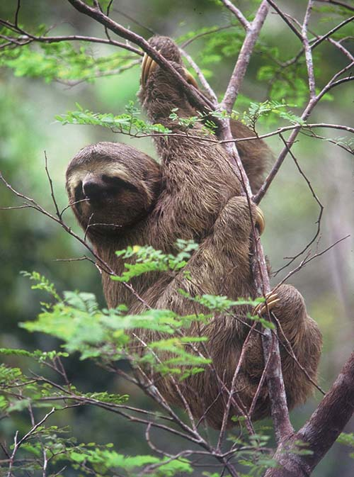
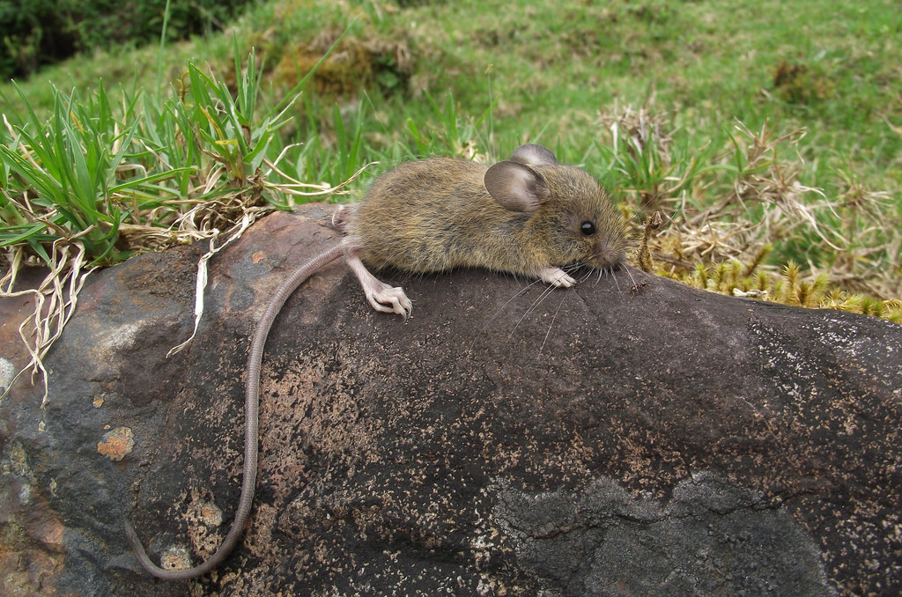
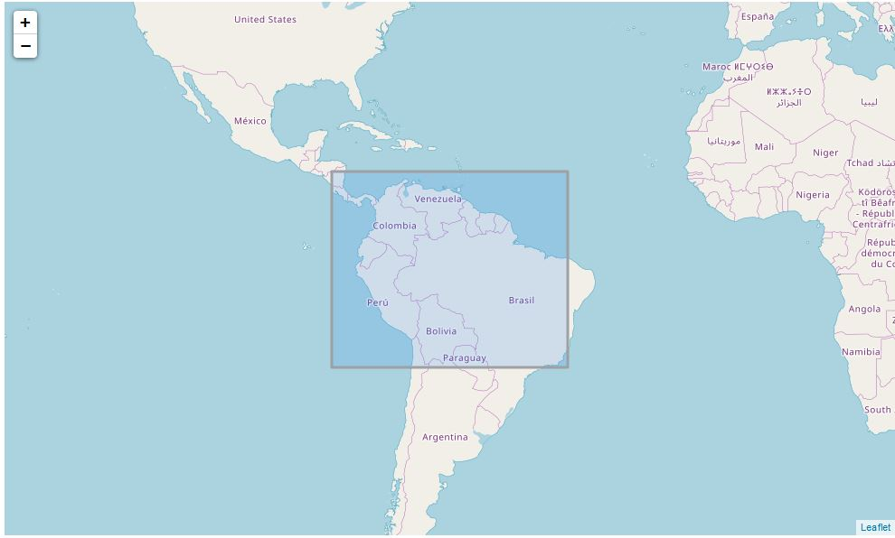
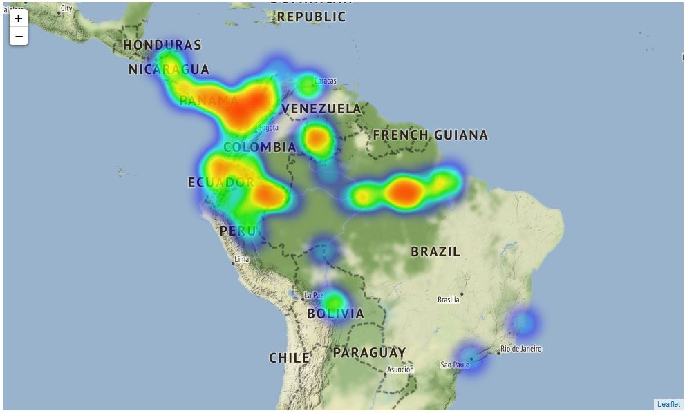
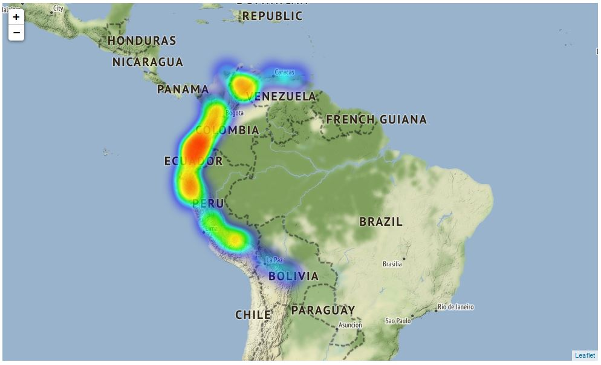

# Species Distribution Heatmaps

Modeling geographical distributions of the species is important in coservation and research. In this notebook I'll use ***species distributions*** dataset from sklearn to model distributions of two species in South America.
## The Dataset
This dataset is originally created by Phillips et. al. (2006). Their original paper can be found [here](http://rob.schapire.net/papers/ecolmod.pdf).
#### There are two species in this dataset
### Bradypus Variegatus  (*the Brown-throated Sloth*)

### Microryzomys Minutus (*the Forest Small Rice Rat*)

## Results
### Coverage Map

### Brown-throated Sloth distribution heatmap

### Forest Small Rice Rat distribution heatmap

